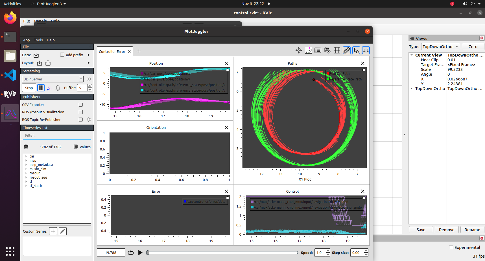
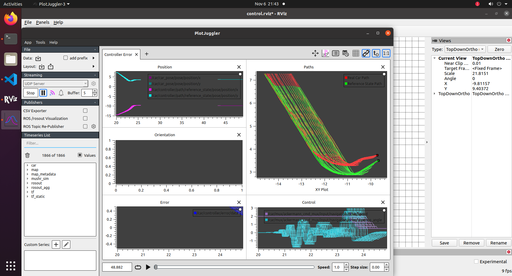
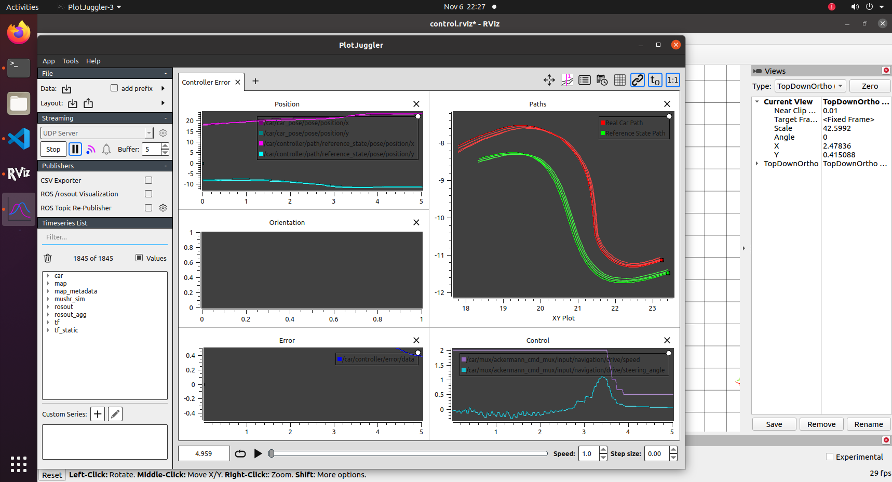
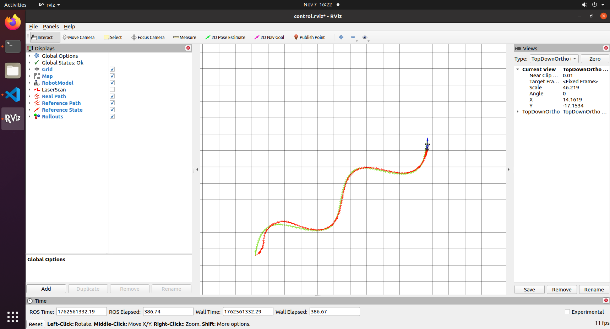
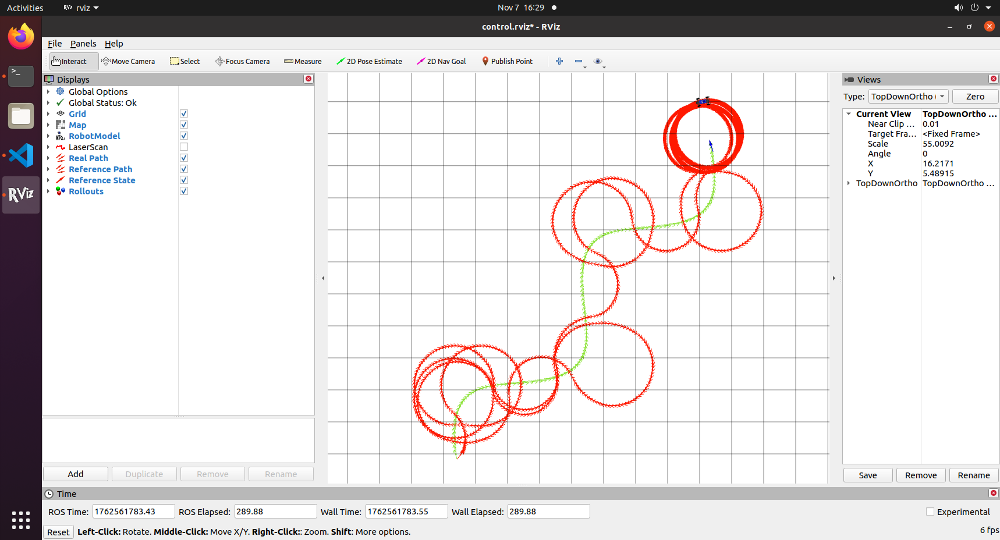
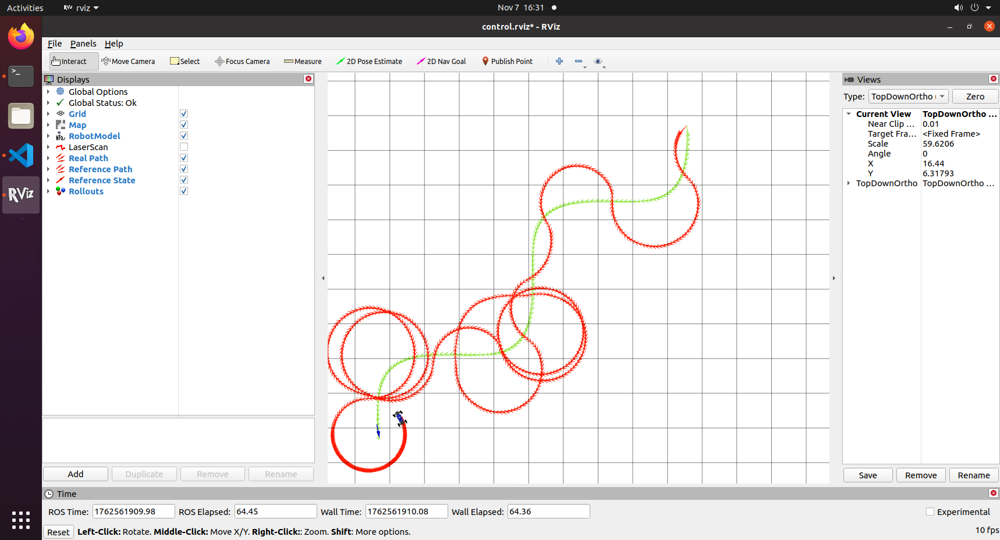
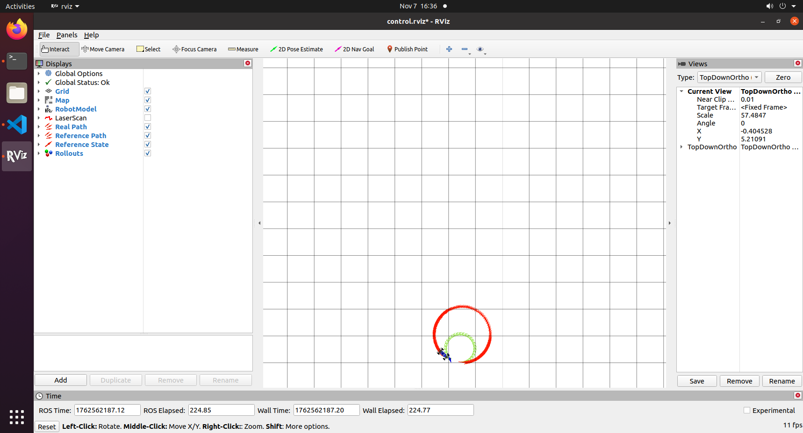
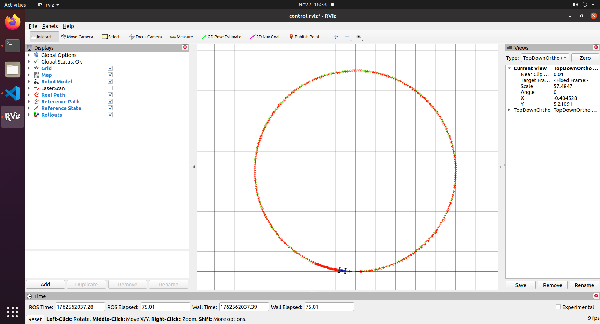

# Project 3: Control 

Replace this with your own writeup! Please place all figures in this directory.

Q1:
When the Kd value was low, the controller exhibited oscillation and overshoot, as there was insufficient damping in the steering response.
As I increased Kd, the oscillations and overshoot gradually reduced.
A higher derivative gain provided stronger damping, which helped the vehicle stabilize around the reference path and reduced aggressive steering corrections.

Q2:
pid:
  kp: 0.05
  kd: 0.95
The tuning process involved finding a balance between responsiveness and damping.
With the default values, the robot oscillated and overshot around the path, indicating under-damped dynamics.
I started with a small Kd = 0.1, which made the oscillation worse.
By gradually increasing Kd (to 0.7, then to 0.95), I observed that the robot’s motion became smoother and the overshoot nearly disappeared.
This final gain combination provided a stable tracking performance without making the robot sluggish.

Q3:
pid:
  kp: 0.05
  kd: 0.95
pp:
  distance_lookahead: 0.7

To reduce excessive curvature and improve path stability, I tuned the distance_lookahead parameter step by step.
Starting with 0.1 of distance_lookahead, the robot reacted too sharply to local curvature and often spun at the end of the path.
Increasing it to 0.5 improved stability but still caused instability at the goal.
At 0.7, the robot achieved a smoother trajectory, smaller curvature error, and a clean stop at the end of the reference path.

Q4:

PP_small (distance lookahead = 0.1): The model became very responsive, where it takes aggressive turns. It seems like its overreacting to every curves.
pp_large (distance lookahead = 1.5): The model became smoother and more stable to track. but a wider turning radius.

Q5:

When following a 5 m radius circle, the robot tracked the reference trajectory accurately and maintained a smooth curvature with minimal steady-state error.
However, at a 0.5 m radius, the curvature required exceeded the robot’s steering limits.
This caused understeering and orbiting behavior, where the robot circled instead of following the smaller path.

Q6:

Q7:

Q8:

Q9:
Upon tuning our model, we found out
a. pid, our most robost variables were kp = 0.05, and kd = 0.95
b. pp, the idea distance_lookahead: 1.0 
c. mpc: K = 8 and T = 12
These values provided the most accurate and robust assessment of our robot. it enabled the Robot to navigate all 3 obstacles in the simulation.
There was a lot of promise when we tuning the mpc values. MPC allows the robot to see further ahead, anticipate obstacles and provide a solution. 
This feature enables the robot to find a solution before meeting the problem and thus provides the best in high speed regimes

Q10:
Particle filter Video: https://drive.google.com/file/d/1LP4O7IAUXu6dQxYtQ48asGNjiZBGqWjk/view?usp=drive_link

Q11:
pp video: https://drive.google.com/file/d/1D29HZS6hnVpiHgB4QlPdELw810_EL7Kk/view?usp=drive_link
pid video: pid-vid.MOV
mcp video: mpc-vid.MOV

